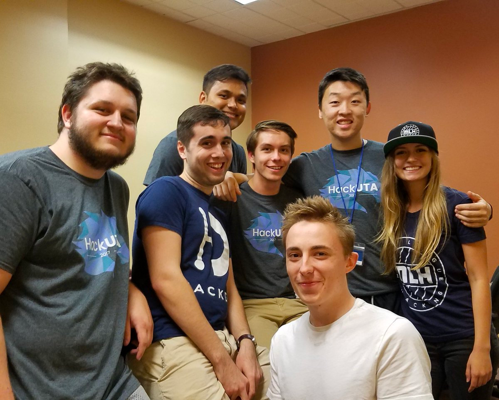

# Hackathon History 101

## What is a Hackathon?

Hackathons are an incredible way to bring your community together to learn new skills, build amazing projects, and share ideas. A hackathon is best described as an **“invention marathon”**. Anyone who has an interest in technology attends a hackathon to learn, build & share their creations over the course of a weekend in a relaxed and welcoming atmosphere. You don’t have to be a programmer and you certainly don’t have to be majoring in Computer Science!

## History of the Hackathon Landscape

The landscape of Hackathons has changed drastically since the inception of the first collegiate hackathon, PennApps (University of Pennsylvania), in 2009. The Collegiate Hackathon golden age took place in the 2010s as increasing corporate interest and investment was funneled into new talent and emerging technologies like frontend frameworks, mobile app frameworks, cloud computing, and DeFi/Web3. This golden age has since "ended" when the entire world went into lockdown due to COVID-19. As such, many corporate investors and their interest to fund Hackathons has since ended, causing a lot of hackathons to re-evaluate their production processes.&#x20;

## Why are Hackathons Actually Important?&#x20;

Nowadays, everything has been invented, created, ideated, founded, thought-of, etc. The likelihood of spinning up a new industry-changing idea is incredibly small as the age of collegiate hackathons grew over a decade old. Since then, the purpose of hackathons have changed. <mark style="color:red;">Hackathons aren't about creating something new, innovative, or something that will over $5M in the first seed round. Hackathons are about students learning new technologies, networking, and having fun all while feeling safe.</mark>

## HackUTA's History

### HackUTA's First Organizing Committees

HackUTA was founded in [2017](https://hackuta2017.devpost.com/) by [Cameron Moreau](https://www.linkedin.com/in/cameron-moreau) and the original organizing team at [Mobi](https://utamobi.com/). After a very successful first year, HackUTA was passed off to Lena Ngungu and the ACM student chapter for HackUTA's 2018 and 2019 production. During the planning stage of HackUTA 2018, there was also discussion about changing HackUTA's name to MavHacks due to conflicts with UTA's student organization naming policies.

<figure><figcaption>
HackUTA 2017 Organizing Team &#x26; Friends
</figcaption></figure>

HackUTA 2017, 2018, and 2019 were VERY successful events, and some of the most important in hackathon history. The events were so popular, even in the pictured above 2 very important individuals are included: Jake Wilkerson (JPMorgan Chase & Co. Code for Good Hackathon Director / Former HackDFW director) and Jake Walsh (HackDFW Founder/Owner).

<figure><figcaption>
HackUTA 2018 Cup Stacking
</figcaption></figure>

### HackUTA's Second Organizing Committees (Revival)

When the pandemic struck the world March 2020, it also hit the Hackathon landscape very hard. Almost every hackathon moved to the new digital-first format or faded away and discontinued. Unfortunately HackUTA did not survive. In August 2022, former HackUTA faculty advisor, Christopher McMurrough, wanted to restart HackUTA but didn't have a team to create a hackathon with. In 2022,  [Ryan Lahlou](https://www.linkedin.com/in/lryanle/) (B.S. CS '24), was restarting the ACM chapter at UTA and wanted to restart HackUTA aswell. After a meeting with Dr. McMurrough, a new team for HackUTA was quickly formed. This team included [Trevor Reigh](https://www.linkedin.com/in/trevor-reigh) (B.S. History '25 + CS minor) and [Patrick Chang](https://www.linkedin.com/in/pchang3/) (B.S. AE '25) serving as 2022 Executive Directors. The first re-inaugural production had over 300 participants, and ranked as the 6th largest hackathon in Texas. Word of HackUTA's revival and success spread throughout the DFW area, and even landed a mini-event in the [official MLH Organizer Guide](https://github.com/MLH/mlh-hackathon-organizer-guide/tree/master/organizer-resources/host-exciting-mini-events), ideated by [Angelina Abuhilal](https://www.linkedin.com/in/angelina-abuhilal) (B.S. CS '26).

<figure><figcaption>
HackUTA 2022 Opening Ceremony
</figcaption></figure>

The following year, Trevor Reigh and Saja Hussein served as the executive directors for HackUTA's most important production following its revival: HackUTA 2023. With the high stakes to create a successful production riding on the success of HackUTA 2022, it was important to host the best production yet. At best it did. HackUTA 2023 was one of the largest in the US and 4th largest in Texas (\~500+ attendees), and featured new innovative ideas like Murder Mystery, the _infamous (or famous)_ point system, and an overall chill-vibe hackathon.

<figure><figcaption>
HackUTA 2023 Opening Ceremony
</figcaption></figure>

### TechTreeRoot/Scotty Shaw Drama

## Texas Hackathon History

Hackathons in bold are considered medium-large hackathons (250+ attendees / 200+ DevPost participants / 50+ projects submitted). Hackathons in italics have special attendance conditions.

* [HackRice](https://hack.rice.edu/) (Rice; founded 2010)
* [**HackTX**](https://hacktx.com/) **(UT; founded 2012)**
* [**TAMUHack**](https://tamuhack.org/) **(TAMU; founded 2014)**
* [**HackDFW**](https://hackdfw.com/) **(**[**Tapioca Productions**](https://tapioca.is/)**; founded 2015)**
* [CodeRED](https://www.uhcode.red/) (UH; founded 2015)
* [**HackUTD**](https://hackutd.co/) **(UTD; founded 2016)**
* [**RowdyHacks**](https://rowdyhacks.org/) **(UTSA; founded 2016)**
* [**HackUTA**](https://hackuta.org) **(UTA; founded 2017)**
* [Hacklahoma](https://hacklahoma.org/) (OU; founded 2018)
* [HackUNT](https://www.hackunt.org/) (UNT; founded 2018)
* [_HowdyHack_](https://tamuhack.org/hh) _(TAMU only; founded 2018)_
* [HackSMU](https://hacksmu.org/) (SMU; founded 2019)
* [HackWesTX](https://www.hackwestx.tech/) (TT; founded 2019)
* [**TAMU Datathon**](https://tamudatathon.com/) **(TAMU; founded 2019)**
* [_HackTAMS_](https://hacktams.org/) _(UNT TAMS HS only; founded 2019)_
* [UTA Datathon](https://datathon.library.uta.edu/) (UTA; founded 2022)
* [Rowdy Datathon](https://www.rowdydatathon.org/) (UTSA; founded 2022)
* [UNT NSBE Hack](https://www.untnsbe.com/) (UNT; founded 2022)
* [**WEHack**](https://wehackutd.com/) **(UTD; founded 2022)**
* [Axxess Hackathon](https://www.axxess.com/hackathon) (UTD; founded 2023)

## HackUTA In the Press



















Videos

[https://www.youtube.com/watch?v=LVRZ-xVmAX8](https://www.youtube.com/watch?v=LVRZ-xVmAX8)

[https://www.youtube.com/watch?v=AQg5ctJbAdg](https://www.youtube.com/watch?v=AQg5ctJbAdg)

[https://www.youtube.com/watch?v=b1\_xGgzghfU](https://www.youtube.com/watch?v=b1\_xGgzghfU)

### Famous Youtube/TikTok Influencer Ben Awad at HackUTA 2017

<table data-view="cards"><thead><tr><th></th><th></th><th></th></tr></thead><tbody><tr><td></td><td></td><td></td></tr><tr><td></td><td></td><td></td></tr><tr><td></td><td></td><td></td></tr></tbody></table>



